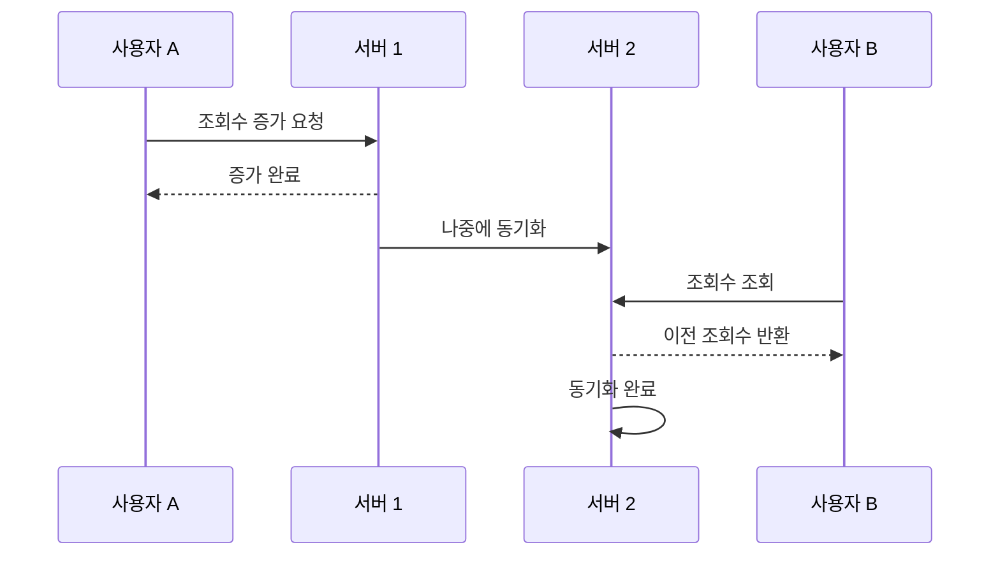
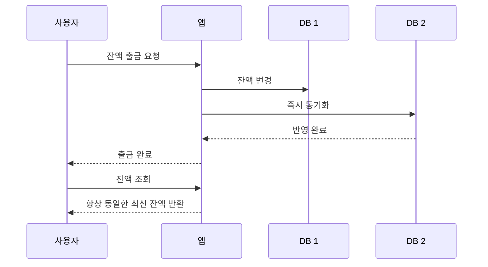

## 일관성

### 일관성의 의미
일관성의 사전적 의미는 '하나의 방법이나 태도 따위로 처음부터 끝까지 한결같이 나아가는 성질' 이다.  
쉽게 말해, 이랬다저랬다 상황이나 기분에 따라 바뀌지 않고, 처음 정한 원칙이나 행동, 태도를 끝까지 똑같이 유지하는 모습을 뜻한다.

### 일관성과 예측 가능성
일관성이 있다는 것은 곧 **예측 가능하다**는 의미로도 해석할 수 있다.  
나는 예측 가능한 시스템이 잘 만들어진 시스템이라고 생각한다. 그 이유는 어떤 행동을 했을 때 어떤 결과가 나올지 어느 정도 예상할 수 있다면, 그에 맞는 대응도 가능하기 때문이다.  

반대로 예측 불가능한 시스템이라면 개발자는 늘 불안할 수밖에 없다. 어떤 상황에서 오류가 발생할지, 어떤 입력에서 예외가 터질지, 왜 어제는 잘 되던 기능이 오늘은 실패하는지 감을 잡기 어렵기 때문이다.  
결국 예측 불가능성은 디버깅 비용을 높이고, 시스템에 대한 신뢰도도 떨어뜨린다.

### 현실 세계에서의 일관성
사람을 대할 때도 비슷하다. 감정 기복이 심하고 상황에 따라 태도가 크게 달라지는 사람보다, 한결같고 반응이 안정적인 사람을 상대하는 것이 훨씬 편하다.  
왜냐하면 그 사람의 반응을 어느 정도 예상할 수 있고, 관계 속에서 불필요한 긴장이나 피로가 줄어들기 때문이다.  
이처럼 일관성은 현실 세계의 인간관계에서도 중요하고, 소프트웨어 세계에서도 매우 중요한 가치다.

### 소프트웨어에서 일관성이 중요한 이유
소프트웨어에서 일관성은 단순히 “항상 똑같다”는 감각적인 표현을 넘어, **시스템의 신뢰성과 안정성을 결정하는 핵심 요소**가 된다.  
특히 분산 시스템에서는 하나의 데이터를 여러 서버나 여러 데이터베이스가 나누어 저장하고 처리하기 때문에, 일관성이 더 중요해진다.  
데이터가 여러 곳에 복제되어 있을 때 각 사본이 서로 다른 값을 가지고 있다면 사용자는 같은 요청을 해도 보는 위치나 시점에 따라 다른 결과를 경험하게 된다. 이런 차이는 혼란을 만들고, 심한 경우 서비스에 대한 신뢰를 무너뜨릴 수 있다.

### 데이터 관점에서의 일관성
데이터 관점에서 일관성은 하나의 데이터를 갖고 있는 모든 사본 또는 인스턴스가 모든 시스템 및 데이터베이스에서 동일한 데이터 상태를 나타내는 것을 의미한다.  
즉, 일관성이 보장된 데이터는 사용자가 어느 곳에 접근하여 데이터를 읽든 항상 동기화된 동일한 상태의 데이터 값을 보장해야 한다는 것이다.

하지만 현실의 시스템에서는 성능, 가용성, 네트워크 지연 같은 여러 제약이 존재하기 때문에 모든 상황에서 완벽한 일관성을 즉시 보장하기가 쉽지 않다.  
그래서 시스템은 서비스의 특성과 목적에 따라 어느 수준까지 일관성을 보장할 것인지 선택하게 된다.  
이러한 관점에서 대표적으로 이야기되는 일관성에는 **최종 일관성(Eventual Consistency)** 과 **강한 일관성(Strong Consistency)** 이 있다.

## 최종 일관성 (Eventual Consistency)
### 최종 일관성의 개념
최종 일관성은 데이터를 어떻게 저장하든, 최종적으로는 해당 데이터를 갖고 있는 모든 데이터베이스가 동일한 상태로 수렴하면 된다는 개념이다.  
즉, 데이터가 변경된 직후에는 잠시 동안 각 사본의 상태가 서로 다를 수 있지만, 시간이 지나면 결국 같은 값으로 맞춰진다는 것을 의미한다.

### 최종 일관성의 예시
예를 들어 내가 유튜브 동영상을 시청해 조회수가 1 증가했다고 하자.  
이때 어떤 사용자는 이미 증가된 조회수를 볼 수 있지만, 다른 사용자는 잠시 동안 이전 조회수를 볼 수도 있다.  
하지만 몇 초 혹은 몇 분 뒤에는 모든 사용자에게 같은 조회수가 보이게 된다.  
이처럼 **지금 당장은 다를 수 있지만, 결국은 같아지는 것**이 최종 일관성의 핵심이다.

### 최종 일관성이 필요한 이유
최종 일관성은 시스템의 처리 속도와 가용성을 높이기 위해 자주 사용된다.  
모든 데이터 변경을 모든 서버에 즉시 반영하려고 하면 응답 시간이 느려질 수 있고, 일부 서버에 문제가 생겼을 때 전체 서비스가 영향을 받을 수도 있다.  
반면 최종 일관성은 일시적인 불일치를 허용하는 대신, 더 빠르게 응답하고 더 유연하게 시스템을 운영할 수 있게 해준다.

즉, 최종 일관성은 데이터가 변경된 직후 짧은 시간 동안 사본 간 데이터 불일치 상태를 허용하지만, 결과적으로는 모든 사본이 동일한 상태로 수렴하는 것을 보장하는 개념이다.  
이는 “지금 이 순간 완전히 같아야 한다”보다 “조금 늦더라도 결국 맞춰진다”에 더 초점을 둔 방식이라고 볼 수 있다.

### 최종 일관성이 유용한 상황
최종 일관성은 유튜브 조회수, 인스타그램 좋아요 수, 게시글 조회 수처럼 **잠시 값이 어긋나더라도 사용자에게 치명적인 문제가 되지 않는 서비스**에서 유용하다.  
이런 데이터는 몇 초 정도 늦게 반영되더라도 사용자가 큰 불편을 느끼지 않는 경우가 많다.  
오히려 즉각적인 완전 일치를 위해 시스템 성능을 희생하는 것이 더 비효율적일 수 있다.

또한 SNS 피드, 댓글 수, 추천 수처럼 대규모 트래픽이 몰리는 서비스에서도 최종 일관성은 실용적이다.  
수많은 사용자가 동시에 데이터를 읽고 쓰는 상황에서 모든 요청에 대해 즉시 완전한 동기화를 보장하려고 하면 시스템 비용이 급격히 커질 수 있기 때문이다.  
이럴 때 최종 일관성은 현실적인 타협점이 된다.

### 최종 일관성의 한계
하지만 모든 상황에 적합한 것은 아니다.  
처리 속도가 빠르다는 장점이 있지만, 데이터의 순간적인 불일치가 사용자의 경험을 떨어뜨릴 수 있는 경우도 있다.

예를 들어 재고가 1개 남은 상품을 A 사용자가 보고 결제를 진행했다고 하자.  
그런데 재고 차감이 아직 다른 서버에 반영되기 전에 B 사용자가 동일한 상품을 보면, 여전히 재고가 1개 남아 있다고 보일 수 있다.  
B 사용자는 상품을 주문할 수 있다고 생각하고 주소 입력과 결제까지 진행했지만, 마지막 순간에 품절 메시지를 보게 될 수도 있다.  
사용자는 “분명 구매 가능하다고 했는데 왜 안 되지?”라는 실망감을 느낄 수 있다.

즉, 최종 일관성은 **사용자 경험에 큰 문제가 없는 범위 내에서만** 효과적인 전략이다.  
데이터의 약간의 지연이 허용되는 영역에서는 강력하지만, 그 지연이 곧바로 손해나 서비스 신뢰도 저하로 이어지는 영역에서는 신중하게 사용해야 한다.

### 강한 일관성의 개념
강한 일관성은 데이터가 변경되는 즉시 모든 사본에 동일하게 반영되어, 어떤 시점에 어떤 사용자가 데이터를 읽더라도 항상 동일한 값을 보장하는 방식이다.  
즉, 데이터가 한 번 갱신되면 그 직후부터는 어디에서 읽든 같은 결과가 나와야 한다.

쉽게 말하면, 어떤 사용자가 값을 변경했다면 다른 사용자는 절대로 “이전 값”을 보아서는 안 된다.  
강한 일관성에서는 최신 데이터가 모든 시스템에 반영되기 전까지 읽기나 쓰기 과정이 제어도록 만든다.

### 강한 일관성의 예시
예를 들어 은행 계좌에서 10만 원이 출금되었다면, ATM, 모바일 앱, 인터넷 뱅킹, 내부 정산 시스템 어디에서 계좌를 조회하든 모두 동일한 잔액이 보여야 한다.  
어떤 채널에서는 출금 전 잔액이 보이고, 다른 채널에서는 출금 후 잔액이 보인다면 심각한 문제를 초래할 수 있다.  
이처럼 돈, 결제, 주문, 예약, 재고처럼 **정확성이 속도보다 더 중요한 영역**에서는 강한 일관성이 필수적이다.

### 강한 일관성의 장점
강한 일관성의 가장 큰 장점은 신뢰성이다.  
사용자는 언제 어디서 데이터를 읽더라도 같은 결과를 기대할 수 있고, 개발자 역시 시스템의 상태를 더 명확하게 이해할 수 있다.  
그만큼 비즈니스 로직도 단순해지고, “어느 서버에서는 아직 반영되지 않았을 수 있다” 같은 예외 상황을 덜 고려해도 된다.

### 강한 일관성의 비용
다만 강한 일관성은 그만큼 비용이 크다.  
모든 사본이 같은 상태가 될 때까지 기다려야 하므로 응답 속도가 느려질 수 있고, 네트워크 지연이나 일부 노드 장애가 전체 처리에 영향을 줄 수 있다.  
즉, 강한 일관성은 정확성과 신뢰성을 높여 주지만, 성능과 가용성 측면에서는 더 많은 희생을 요구하는 방식이기도 하다.

### 어떤 상황에 강한 일관성이 적합한가
결국 시스템 설계에서 중요한 것은 “무조건 강한 일관성이 좋다” 혹은 “최종 일관성이 더 효율적이다”처럼 하나의 답을 고르는 것이 아니다.  
핵심은 **어떤 데이터가 얼마나 즉시 정확해야 하는지**, 그리고 **사용자가 어느 정도의 지연이나 불일치를 받아들일 수 있는지**를 기준으로 적절한 방식을 선택하는 것이다.

조회 수나 좋아요 수처럼 조금 늦게 반영되어도 괜찮은 데이터에는 최종 일관성이 적합할 수 있다.  
반면 결제 금액, 계좌 잔액, 좌석 예약, 재고 수량처럼 순간적인 오차조차 큰 문제를 만들 수 있는 데이터에는 강한 일관성이 더 적합하다.

## 마무리
일관성은 단순히 데이터를 똑같이 맞추는 기술적 개념이 아니라, 시스템에 대한 사용자의 신뢰를 만드는 중요한 속성이라고 생각한다.  
사용자는 내부 구조를 알지 못하더라도 서비스가 “예상한 대로 동작하는가”를 통해 그 시스템을 평가한다.  
그리고 그 예측 가능성을 만들어 주는 핵심 요소 중 하나가 바로 일관성이다.

결국 좋은 시스템이란 무조건 빠르기만 한 시스템도, 무조건 엄격하기만 한 시스템도 아니다.  
상황에 따라 어느 정도의 일관성을 선택할지 분명한 기준을 가지고, 사용자 경험과 비즈니스 요구사항 사이에서 균형을 잘 맞춘 시스템이 좋은 시스템이라고 생각한다.
