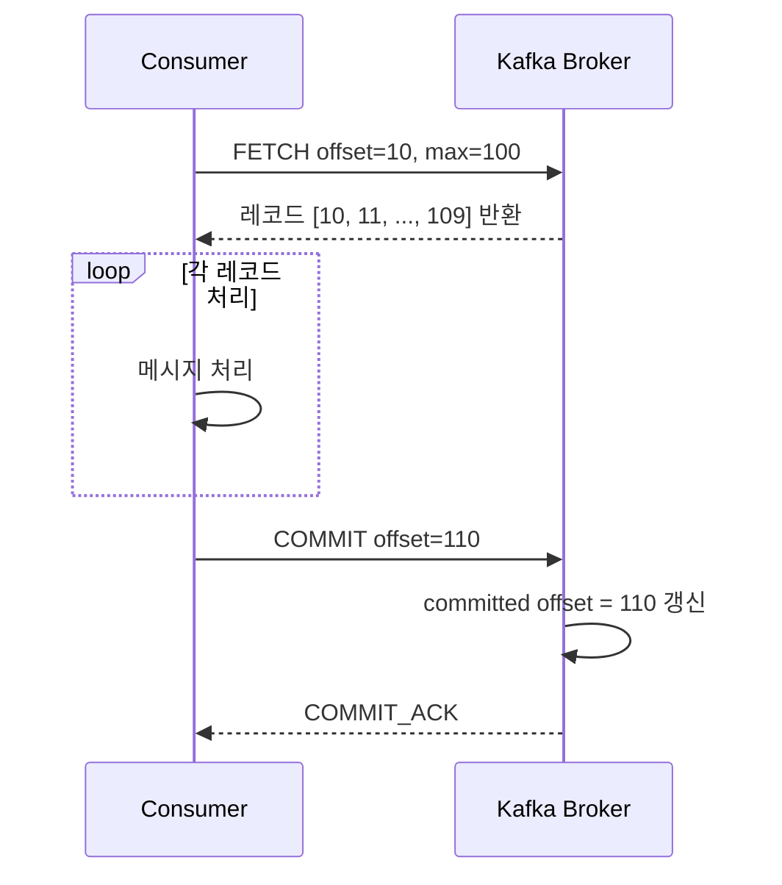
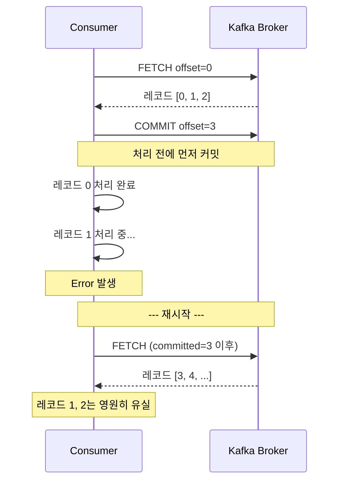
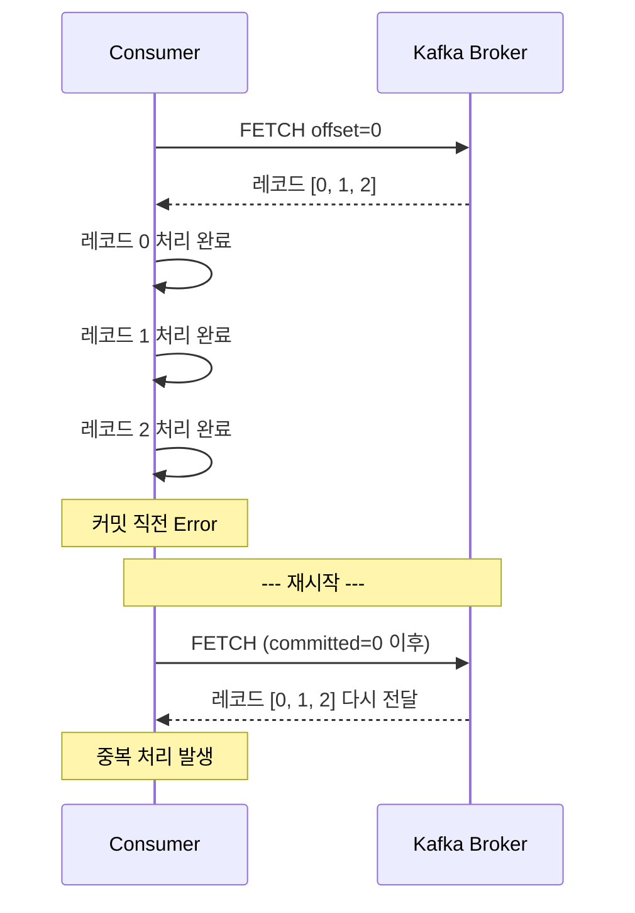
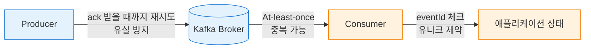

## 개요
이전 글에서 멱등성 키 하나로 중복 결제를 막는 원리에 대해 이야기했다.  
네트워크는 언제든 끊길 수 있고, 클라이언트는 언제든 같은 요청을 다시 보낼 수 있으니, 서버는 같은 요청이 여러 번 들어와도 결과가 달라지지 않도록 설계되어야 한다는 내용이었다.

최근 간단하게 Kafka를 직접 구현하며 학습하다가 흥미로운 점을 마주했다.  
Kafka가 기본값으로 제시하는 메시지 전달 보장이 "한 번만 정확히(exactly-once)"가 아니라 **"적어도 한 번(at-least-once)"** 이라는 것이다. 즉, Kafka는 메시지가 중복될 수 있음을 전제로 동작한다.

중복 결제 한 건이 얼마나 치명적인지 알고 있던 입장에서 이 기본값은 조금 의아했다. 메시지 브로커가 "중복은 어쩔 수 없다"고 말하는 것처럼 들렸기 때문이다.

하지만 구현을 따라가며 Consumer의 동작을 들여다보니, 이 선택은 타협이라기보다 의도된 설계에 가까웠다. 그리고 그 설계를 완성하는 마지막 조각이 이전 글에서 다룬 멱등성이었다.

이번 글에서는 Kafka Consumer의 오프셋 커밋 시점이 왜 중요한지, 그리고 왜 결제 시스템이 결국 At-least-once와 멱등성의 조합을 선택하게 되는지 정리해보려 한다.

## Consumer가 메시지를 "소비한다"는 것
Kafka에서 Consumer는 메시지를 push 받지 않는다. 브로커에게 "나 어디까지 읽었으니까, 그 다음부터 몇 개만 줘" 하고 직접 가져간다(pull). 이때 어디까지 읽었는지를 기록하는 값이 **offset** 이다.

여기서 중요한 점은, Consumer가 메시지를 받는다고 해서 그 메시지가 소비된 것으로 처리되지 않는다는 것이다. Consumer가 오프셋을 명시적으로 커밋해야 비로소 브로커는 "이 Consumer가 여기까지 처리를 끝냈구나" 하고 인식한다.

얼핏 단순해 보이지만, 이 흐름에는 한 가지 까다로운 질문이 숨어 있다.  
처리와 커밋 중 무엇을 먼저 할 것인가?

이 선택이 Kafka의 두 전달 보장, **At-most-once**와 **At-least-once**를 가른다.

## 커밋 시점이 만드는 두 가지 세계
### At-most-once: 처리하기 전에 커밋한다
먼저 처리하기 전에 커밋부터 하는 전략을 생각해보자.

이 방식은 error가 일어나도 같은 메시지를 다시 처리할 일이 없다. 커밋이 이미 되어 있으니, 재시작한 Consumer는 이미 처리된 것으로 간주된 메시지 이후부터 가져간다.

하지만 단점은 명확하다. 위 시나리오처럼 처리 도중 error가 나면 그 메시지는 유실된다. 브로커는 Consumer가 이미 처리했다고 믿지만 실제로는 처리되지 않은 채로 남는다.

이것이 At-most-once, 즉 "메시지는 최대 한 번만 전달된다(유실될 수는 있지만 중복되지는 않는다)"는 보장이다.

### At-least-once: 처리한 후에 커밋한다
반대로 처리가 끝난 다음에 커밋하는 전략을 보자.

이 방식은 error가 나도 메시지가 유실되지 않는다. 커밋되지 않은 상태에서 Consumer가 죽으면, 재시작했을 때 같은 offset부터 다시 읽어오기 때문이다.

대신 처리는 끝났는데 커밋 직전에 error가 나면, 재시작한 Consumer는 동일한 메시지를 한 번 더 처리하게 된다. 즉 중복이 발생할 수 있다.

이것이 At-least-once, "메시지는 적어도 한 번은 전달된다(유실되지는 않지만 중복될 수는 있다)"는 보장이다.

## 유실과 중복, 무엇이 더 나쁜가
여기서 개발자는 선택의 기로에 선다. 유실을 허용할 것인가, 중복을 허용할 것인가.

얼핏 대등해 보이지만, 결제 시스템의 관점에서는 그렇지 않다.

유실이 발생한 상황을 상상해보자.  
사용자는 결제를 완료했고, PG사에서는 돈이 빠져나갔다. 그런데 그 "결제 완료" 이벤트가 Consumer에서 유실되어 내부 시스템에 반영되지 않았다면 어떤 일이 벌어질까?

- 주문은 여전히 '결제 대기' 상태로 남는다.
- 배송, 적립, 쿠폰 사용 같은 후속 처리도 이루어지지 않는다.
- 사용자는 "돈은 빠져나갔는데 주문은 왜 안 잡혔지?"라며 고객센터에 문의한다.
- 운영팀은 어디서 이벤트가 사라졌는지 역추적해야 한다.

유실의 진짜 문제는 이 일이 일어났다는 사실 자체를 감지하기 어렵다는 점이다. 무언가 빠졌다는 것을 알아채려면 별도의 정합성 체크 로직이 필요하고, 발견이 늦어질수록 복구 비용도 빠르게 커진다.

반면 중복이 발생하면 어떨까?  
같은 결제 완료 이벤트가 Consumer에 두 번 전달되면 시스템은 같은 주문에 대해 두 번 후처리를 시도한다. 그런데 이 중복은 이미 예상 가능한 사건이다.

이전 글에서 다룬 멱등성 키를 떠올려보자. 같은 주문 ID, 같은 이벤트 ID로 요청이 두 번 들어오면 두 번째 요청은 무시되거나 이전 결과를 그대로 돌려준다. 즉 중복은 이미 방어할 준비가 되어 있는 문제다.

유실과 달리 중복은 감지하기 쉽고, 방어 수단도 이미 존재한다. 결제 시스템이 At-least-once를 선택하는 이유는 여기에 있다.

## Kafka가 "중복 허용"을 기본값으로 둔 이유
이 관점에서 보면 Kafka의 설계 의도가 조금 더 선명해진다.  
Kafka는 "메시지를 절대 유실하지 않는 것"을 최우선 가치로 두는 시스템이다.

메시지 브로커의 본질적인 역할은 결국 데이터가 A에서 B로 반드시 전달되도록 보장하는 것이다. 그런데 "반드시 한 번만"까지 함께 보장하려면 Producer-Broker-Consumer 사이의 모든 네트워크 구간에서 중복을 완전히 차단해야 한다. 현실의 네트워크에서 이 비용은 대단히 크다.

Kafka는 이 원칙을 구현 레벨에서도 그대로 유지한다.

- Producer는 메시지가 브로커에 저장됐다는 ack를 받을 때까지 재시도한다. ack가 네트워크 문제로 유실되면 Producer는 브로커가 이미 저장했는지 모른 채 같은 메시지를 다시 보낸다.
- Consumer는 처리 후 커밋하는 방식을 기본으로 한다. 커밋이 실패하거나 Consumer가 죽으면, 재시작 후 같은 메시지를 다시 읽는다.

두 지점 모두 중복의 가능성을 포함한다. Kafka는 이를 완전히 막으려 애쓰지 않고, 대신 Consumer 쪽에서 멱등하게 처리할 것을 요구한다.  
메시지 전달의 신뢰성은 브로커가, 중복 처리의 방지는 애플리케이션이 맡는 일종의 역할 분담이다.

왼쪽(파란색)은 유실 방지를 책임지는 Kafka의 영역, 오른쪽(주황색)은 중복 흡수를 책임지는 애플리케이션의 영역이다.

## 그렇다면 Exactly-once는 없는가
"유실도 중복도 싫다. 정확히 한 번만 전달되는 방법은 없나?"

Kafka는 실제로 Exactly-once Semantics(EOS)를 제공한다. Transactional Producer와 Consumer의 `isolation.level=read_committed` 설정을 조합하면, Kafka 생태계 안에서는 "정확히 한 번"의 전달을 기술적으로 구현할 수 있다.

다만 두 가지 제약이 있다.

하나는 적용 범위다. Kafka의 트랜잭션은 Kafka 안에서만 유효하다. Consumer가 메시지를 읽어 외부 시스템(PG사, 은행 API, 외부 DB 등)에 반영하는 순간, Kafka의 트랜잭션 경계는 거기서 끝난다. 결제 시스템의 상당수 연산은 바로 이 경계를 넘나드는 작업이라 EOS만으로는 부족한 경우가 많다.

다른 하나는 비용이다. 트랜잭션 관리, 커밋 조율, 격리 수준 제어 모두 추가 오버헤드를 만든다. 대부분의 실무 결제 시스템이 EOS에 의존하기보다 애플리케이션 레벨에서 멱등하게 만드는 방향을 택하는 이유다.

그래서 실무의 현실적인 선택지는 결국 At-least-once와 애플리케이션 레벨 멱등성의 조합으로 좁혀진다. Kafka 공식 문서와 실무 가이드들도 대체로 이 조합을 권한다.

## 결제 이벤트에서 멱등성은 어떻게 구현되는가
그렇다면 Consumer는 구체적으로 어떻게 멱등하게 동작해야 할까?  
이전 글에서 다룬 멱등성 키의 원리가 거의 그대로 적용된다. 다만 키의 출처가 "클라이언트 HTTP 헤더"에서 "메시지 자체의 필드"로 바뀔 뿐이다.

실무에서는 보통 다음과 같은 방식이 쓰인다.

- 이벤트 ID 기반 중복 제거: 메시지에 `eventId`나 `orderId` 같은 고유 식별자를 담아 보낸다. Consumer는 메시지를 처리하기 전에 이 ID가 이미 처리된 적이 있는지 확인하고, 있다면 건너뛴다.
- DB 유니크 제약 활용: 후처리 결과를 저장할 때 `eventId`에 유니크 제약을 걸어둔다. 중복된 이벤트가 들어오면 제약 위반으로 실패하므로 자연스럽게 차단된다.
- 상태 기반 처리: "이미 결제 완료된 주문은 다시 결제 완료로 바꾸지 않는다"처럼, 최종 상태를 기준으로 다시 처리되어도 결과가 달라지지 않도록 로직을 짠다.

어떤 방식이든 핵심은 같다. 같은 메시지가 두 번 들어와도 시스템의 최종 상태가 달라지지 않아야 한다는 것이다. 멱등성 키 글에서 이야기한 $f(f(x)) = f(x)$ 의 원리가 Consumer 레벨에서도 그대로 적용된다.

## 마치며
Kafka를 처음 접했을 때는 기본 전달 보장이 at-least-once라는 점이 조금 허술해 보였다. 하지만 Consumer의 커밋 흐름을 직접 구현하며 따라가보니, 이 기본값은 "무엇을 브로커에 맡기고 무엇을 애플리케이션에 맡길 것인가"에 대한 분명한 설계 결정이라는 것을 알 수 있었다.

결제 시스템의 관점에서도 결론은 비슷하다. 중복은 멱등성 키로 막을 수 있지만, 유실은 사후 복구가 훨씬 어렵다. 그러니 브로커에게는 유실 방지를 요구하고, 중복은 애플리케이션이 흡수한다.

이전 글에서 다룬 멱등성 키와 이번 글의 At-least-once는 결국 같은 문제를 서로 다른 위치에서 다루고 있는 셈이다. 신뢰할 수 없는 경계를 넘어 데이터를 주고받을 때 피할 수 없이 생기는 중복, 그리고 그것을 시스템이 스스로 흡수하도록 만드는 일. 결제 시스템을 만든다는 것은 이런 경계들을 하나씩 정리해 나가는 과정이 아닐까 싶다.
