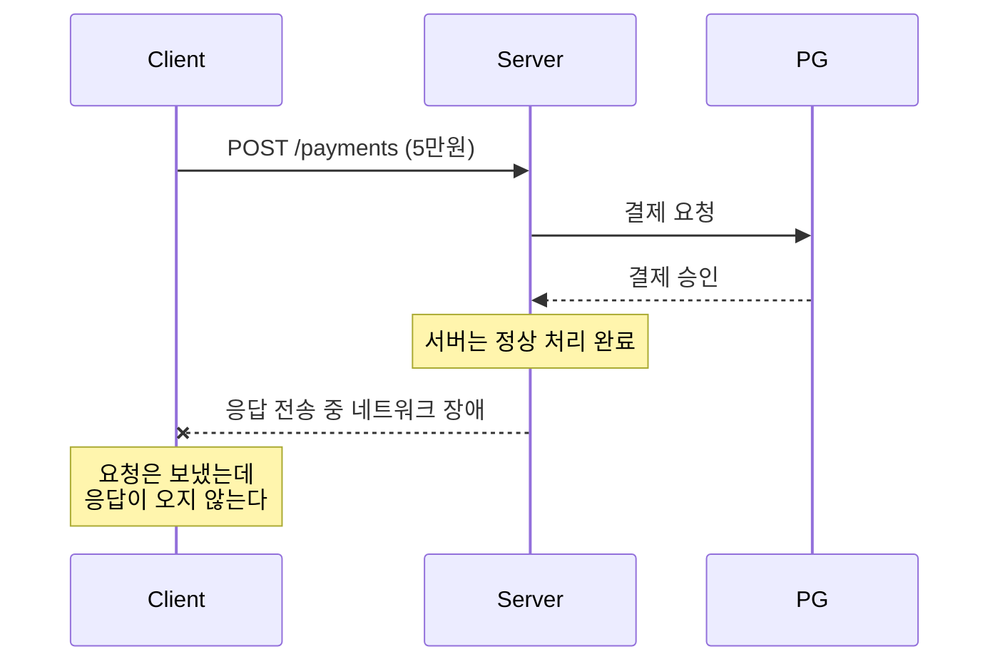
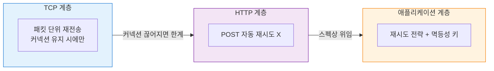

## 개요

[이전 글](https://seungjjun.github.io/system%20design/idempotency-key/)에서 멱등성 키 하나로 중복 결제를 막는 원리에 대해 이야기했다. 그 글은 서버 쪽 방어에 가까웠다. 같은 요청이 여러 번 들어와도 서버가 한 번만 처리하도록 만드는 이야기였다.

그런데 글을 쓰고 나서 한 가지 질문이 남았다. 애초에 같은 요청이 왜 여러 번 들어오는가?

"같은 요청이 여러 번 들어올 수 있다"는 전제를 너무 당연하게 깔고 시작했었다. 정작 그 두 번째 요청이 누가, 어떻게 만들어내는지는 제대로 짚지 않았다.  

브라우저가 알아서 보내는 건지, 사용자가 다시 누르는 건지, HTTP 라이브러리가 처리하는 건지. 막상 대답하려니 확신이 없었다.  
결제 관련 업무를 하다 보면 응답 유실 같은 상황은 늘 "겪을 수도 있는 일"로 머릿속에 남아 있다. 아직 직접 그런 장애를 마주한 적은 없지만, 겪지 않았다고 안심할 수 있는 주제도 아니라고 생각했다. 그래서 이번 기회에 네트워크 경계에서 실제로 어떤 일이 벌어지는지, HTTP 스펙과 클라이언트는 이런 상황을 어떻게 다루도록 설계되어 있는지 정리해보기로 했다

브라우저가 알아서 실패한 요청을 다시 보내주는 걸까? 아니면 사용자가 버튼을 다시 누르는 것만이 원인일까? HTTP 스펙은 이 상황을 어떻게 정의하고 있을까?

이번 글은 멱등성 키의 바로 한 단계 앞, 클라이언트 쪽에서 벌어지는 일을 정리해보려 한다.

## 시나리오: 응답이 돌아오지 않는 결제 요청

구체적인 상황부터 그려보자.

1. 클라이언트가 결제 서버로 `POST /payments` 요청을 보낸다.
2. TCP 커넥션이 정상적으로 맺어지고, 요청 패킷도 서버에 도착한다.
3. 서버는 요청을 받아 PG사에 결제를 위임하고, 5만 원 결제가 정상적으로 처리된다.
4. 서버는 "결제 성공" 응답을 클라이언트로 돌려보낸다.
5. 그런데 그 순간 네트워크 장애가 생겨, 응답 패킷이 클라이언트에 도달하지 못한다.



클라이언트 입장에서는 요청은 분명히 보냈는데 응답이 돌아오지 않는다. 시간이 지나면 타임아웃 에러가 뜬다.

이때 클라이언트는 어떻게 행동해야 할까? 브라우저가 알아서 재시도해주는가, 아니면 에러만 띄우고 끝나는가?

## 브라우저는 POST를 재시도하지 않는다

결론부터 말하면, 대부분의 HTTP 클라이언트는 POST 요청을 자동으로 재시도하지 않는다. **POST는 기본적으로 멱등하지 않기 때문이다.**

근거는 HTTP 스펙(RFC 9110)이 정의하는 메서드별 멱등성에 있다.

* GET, HEAD: 서버 상태를 변경하지 않는 조회. 여러 번 호출해도 안전하다.
* PUT, DELETE: 최종 상태만 중요한 연산. 반복해도 결과가 같다.
* POST: 호출할 때마다 새로운 리소스를 만들거나 상태를 바꾼다.

POST는 멱등하지 않으므로 클라이언트가 임의로 재시도하면 곤란하다. 5만 원이 두 번 결제돼 10만 원이 빠져나갈 수도, 주문이 두 건으로 갈라질 수도 있다.

그래서 표준 HTTP 클라이언트들은 POST를 보수적으로 다룬다.

브라우저도 마찬가지다. 폼을 POST로 제출했다가 응답이 오지 않으면 에러 페이지를 보여줄 뿐, 같은 요청을 알아서 다시 보내지는 않는다. 새로고침 시 "양식을 다시 제출하시겠습니까?" 같은 경고가 뜨는 이유도 여기에 있다. 재시도로 인한 side effect를 사용자에게 명시적으로 확인받는 장치다.

결국 결제 같은 POST 요청의 재시도 여부는 브라우저도, HTTP 라이브러리도 아닌 애플리케이션 코드가 결정해야 한다.

## 클라이언트가 마주한 네 가지 가능성

그런데 애플리케이션이 재시도를 결정하려 해도 한 가지 근본적인 문제가 있다. 타임아웃을 받은 순간 클라이언트가 마주하는 것은 단순한 "실패"가 아니라 정보가 부족한 상태다.

"요청은 보냈는데 응답이 없다"는 이 한 문장 뒤에는 사실 여러 가능성이 숨어 있다.

1. 요청 패킷이 서버에 도달하지 못했다. (결제 시도 없음)
2. 서버가 요청은 받았지만, 처리 전에 죽었다. (결제되지 않음)
3. 서버가 정상적으로 처리를 끝냈지만, 응답 패킷이 유실됐다. (결제됨)
4. 서버가 처리 중 실패했고, 그 실패 응답마저 유실됐다. (결제되지 않음)

클라이언트는 이 넷 중 어느 것인지 구분할 방법이 없다. 손에 쥔 건 타임아웃 에러 하나뿐이다.

재시도를 하면 3번 상황이었을 때 결제가 두 번 일어난다. 중복 결제다.  
재시도를 하지 않으면 3번이었을 때 돈은 빠져나갔는데 주문은 잡히지 않는다. 결제 누락이다.

결국 클라이언트 입장에서는 답이 없다. 다시 보내도 틀릴 수 있고, 안 보내도 틀릴 수 있다.

## 두 장군 문제

분산 시스템에서 이런 상황을 가리키는 유명한 이름이 있다. **두 장군 문제(Two Generals Problem)** 다.

두 부대가 적을 포위하고 있고, 동시에 공격해야만 승리할 수 있다는 설정이다. 공격 시점을 맞추려면 서로 메시지를 주고받아야 하는데, 전령은 적진을 통과하다가 잡힐 수 있다. 메시지를 보낸 쪽은 그것이 도착했는지 알 수 없고, 확인 메시지가 와도 그 확인이 안전하게 도착했는지는 또 보장되지 않는다. 확인의 확인, 확인의 확인의 확인을 끝없이 반복해도 완벽한 합의에 도달할 수 없다는 것이 이 문제의 결론이다.

우리의 결제 시나리오도 이 문제와 닮아 있다. 클라이언트가 장군 A, 서버가 장군 B, 네트워크가 적진을 지나는 전령인 셈이다. 어느 한쪽도 상대방이 요청이나 응답을 받았는지 완벽하게 확인할 방법이 없다. ACK로 추정할 뿐인데, 그 ACK 자체가 또 네트워크를 타고 이동해야 하기 때문이다.

TCP도, HTTP도, 그 어떤 네트워크 프로토콜도 이 한계를 없애지 못한다. 그래서 네트워크 프로그래밍은 이 불확실성을 없애려 하기보다, 불확실성을 전제로 두고 그 위에서 안전하게 동작하도록 설계하는 쪽으로 발전해왔다.

## TCP 재전송과 HTTP 재시도는 다른 이야기다

"TCP는 신뢰성 있는 프로토콜이잖아? 그럼 알아서 재전송해주지 않나?"

자주 혼동되는 지점인데, 레이어가 다르다.

TCP는 패킷 단위의 재전송을 보장한다. 패킷이 유실되면 sequence number와 ACK를 기반으로 같은 패킷을 다시 보낸다. 이 과정은 HTTP보다 한 층 아래에서 일어나고, HTTP 애플리케이션은 이를 의식하지 않아도 된다.

문제는 TCP의 재전송이 같은 커넥션이 유지되는 동안에만 유효하다는 점이다. 커넥션 자체가 끊어지면(타임아웃, RST 등) TCP는 더 이상 할 수 있는 일이 없다. 그 뒤부터는 상위 레이어인 HTTP의 몫이다.

그리고 앞서 말했듯, HTTP 레이어에서는 POST를 자동으로 재시도하지 않는다. "서버에 요청은 닿았고 처리도 끝났는데 응답 전달 중 커넥션이 끊긴" 시나리오에서 TCP는 도움이 되지 않는다. 패킷 레벨 재전송은 이미 불가능하고, HTTP는 재시도를 거부한다.



이 애매한 공백을 메우는 것이 애플리케이션 레벨의 재시도 전략이고, 그 재시도를 안전하게 만드는 도구가 이전 글에서 다룬 멱등성 키다.

## 안전한 재시도를 설계한다는 것

### 먼저 요청을 멱등하게 만든다

재시도를 하기 전에 먼저 물어야 할 질문은 "이 요청은 멱등한가?"다. 멱등하다면 반복해도 결과가 같으니 재시도해도 안전하다. 멱등하지 않다면 재시도가 side effect를 중복시킨다. 재시도 전에 요청 자체를 멱등하게 만들어야 한다.

결제 같은 POST 요청을 멱등하게 만드는 방법은 이전 글에서 정리했다. 클라이언트가 요청마다 고유한 `Idempotency-Key`를 생성해 헤더에 담아 보내고, 서버는 같은 키의 요청을 한 번만 처리한다.

```
POST /payments HTTP/1.1
Idempotency-Key: 550e8400-e29b-41d4-a716-446655440000
Content-Type: application/json

{ "amount": 50000, "orderId": "ORDER-123" }
```

여기서 중요한 원칙 하나. **재시도할 때는 같은 키를 재사용해야 한다.** 매번 새 키를 생성하면 서버 입장에서는 서로 다른 요청이고, 멱등성 키의 의미가 사라진다. 실무에서는 보통 "결제 의도" 단위로 키를 한 번 만들어둔다. 사용자가 결제 버튼을 누르는 순간 UUID를 생성해두고, 그 뒤 재시도가 몇 번 일어나든 같은 키를 그대로 쓴다.

### 재시도해도 되는 에러, 아닌 에러

판단 기준은 하나다. 다시 보내면 성공할 가능성이 있는가.

4xx (잘못된 카드, 잔액 부족 등): 요청 자체의 문제. 재시도해도 같은 결과가 나온다.
5xx (서버 내부 오류, 게이트웨이 타임아웃): 서버 쪽의 일시적 문제일 수 있다. 재시도 후보.
네트워크 에러 (타임아웃, 커넥션 끊김): 응답을 못 받은 상황이라 재시도가 필요하지만, 반드시 멱등성 키가 있어야 한다.

`429 Too Many Requests`나 `503 Service Unavailable`처럼 서버가 명시적으로 재시도 힌트를 주는 응답에는 Retry-After 헤더가 함께 오기도 한다. 이런 신호도 판단에 활용한다.

### 타임아웃은 한 덩어리가 아니다

"타임아웃"을 하나로 묶어서 보면 안 된다. 종류가 다르고 위험도도 다르다.

- Connection timeout: 커넥션 수립에 걸리는 시간. 이 단계에서 실패했다면 요청이 서버에 닿지도 못한 것이므로 비교적 안전하게 재시도할 수 있다.
- Read timeout: 요청을 보낸 뒤 응답을 기다리는 시간. 이 시점의 타임아웃은 서버가 이미 요청을 받아 처리 중일 가능성을 포함한다. 재시도 시 중복 처리 위험이 있는 건 이쪽이다.

Read timeout을 지나치게 짧게 잡으면 서버는 정상적으로 처리하고 있는데 클라이언트가 기다리지 못하고 끊어버리는 상황이 잦아진다. 여기에 재시도까지 엮이면 앞서 본 "응답이 사라진 요청" 시나리오가 반복된다. PG사나 백엔드의 평균 응답 시간과 p99 레이턴시를 보고 정해야 한다. 너무 짧으면 중복을 유도하고, 너무 길면 사용자 경험을 해친다.

## 마치며

네트워크 위에서 당연하게 여기는 "요청과 응답"은 사실 보장된 것이 아니다. 요청은 닿았는데 응답은 사라질 수 있고, 그 사이의 진실은 누구도 완벽히 알 수 없다.

그래서 "요청이 실패했는데 다시 보낼까?"라는 질문은 생각보다 간단하지 않다. 그 안에는 멱등성, 재시도 정책, 타임아웃 설정, 백오프 전략, 두 장군 문제까지 얽혀 있다.

이전 글의 멱등성 키와 이번 글의 재시도 전략은 결국 같은 불확실성을 양쪽에서 덮는 작업이다. 요청을 받는 쪽이 같은 요청을 한 번만 처리하도록 막고, 요청을 보내는 쪽이 언제·어떻게 재시도할지를 규율한다. 

결제 서버 개발자 입장에서는 어느 한쪽만 챙겨도 안 된다. 프론트에서 결제 서버로 들어오는 요청도, 결제 서버에서 PG사로 나가는 요청도 같은 문제에 노출되기 때문이다. 두 장치가 맞물려야 "같은 요청이 여러 번 들어올 수 있다"는 현실 위에서 결제 시스템을 안전하게 운영할 수 있다.

## 참고자료
- [RFC 9110: HTTP Semantics](https://www.rfc-editor.org/rfc/rfc9110.html)
- [Two Generals' Problem - Wikipedia](https://en.wikipedia.org/wiki/Two_Generals%27_Problem)
