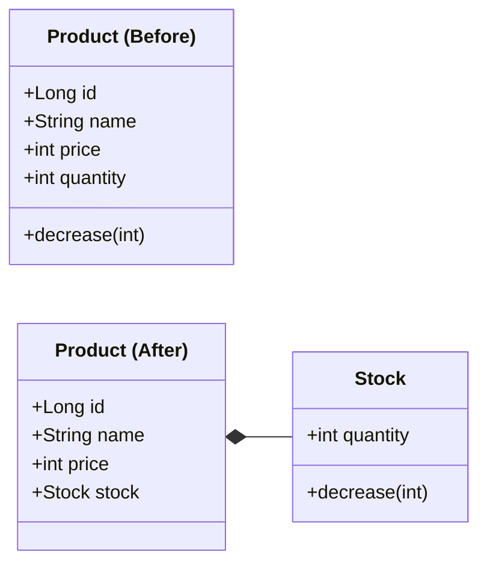
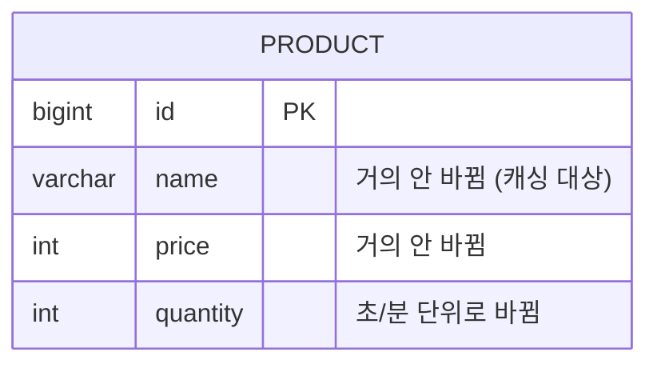

설계를 시각화하는 작업을 진행했다.

요구사항 명세를 쓰고, 클래스 다이어그램을 그리고, 시퀀스 다이어그램을 그리고, ERD를 그렸다. 문서만 작성하다 일주일이 갔다.

그런데 문서를 작성할때가 코드를 작성할때 보다 더 많은 고민과 생각을 하는 시간이었다.

## 깔끔했는데, 찝찝했다

클래스 다이어그램을 그리다가 상품(Product)과 재고(Stock)를 어떻게 둘지 고민했다.

처음에는 Product 안에 `int quantity` 필드로 두려고 했다.
그런데 재고를 차감하는 로직(0 미만이면 예외를 던지는 불변식)이 Product 안에 직접 들어가는 게 걸렸다. 재고 차감은 상품의 책임이라기보다 재고의 책임이니까. 그래서 Stock이라는 VO를 만들고 `decrease()`를 그쪽에 위임했다.
책임이 제자리를 찾은 느낌이었고, 모델링도 깔끔했다.

재고는 상품과 함께 태어나고 함께 사라진다. Lifecycle이 같으니 VO로 묶는 게 자연스럽다고 생각했다.

그런데 다이어그램을 마저 작성하다가, 한 가지가 걸렸다.
결국 시스템을 설계하는 건 서비스를 운영하기 위해서다.
그러면 이 모델이 실제로 돌아갈 때 문제가 되는 게 뭐가 있을지 생각해봤다.

상품 정보는 거의 안 바뀐다. 이름, 가격, 설명. 몇 달에 한 번 바뀔까 말까한 데이터다. 조회 트래픽은 높으니 캐싱 대상이 된다.
그런데 재고는 정반대다. 인기 상품이면 분 단위로, 초 단위로 바뀐다. (트래픽이 높다는 가정하에..)

Stock을 VO로 분리했어도 DB에서는 결국 같은 row의 `quantity` 컬럼이다. 물리적으로는 분리되지 않는다.

이 둘이 같은 행에 있으면 재고가 바뀔 때마다 상품 캐시가 흔들리고, 재고 차감과 상품 설명 수정이 같은 행의 락을 두고 대기한다.
OOP 차원에서는 깔끔하게 닫혔는데, 저장 구조 차원에서는 열려 있었다.

> Lifecycle이 같다는 것과 같은 행에 저장된다는 건 다른 문제였다.  

같이 태어나고 같이 죽는다고 해서, 살아 있는 동안 같은 빈도로 바뀌는 건 아니다.

설계 단계에서 운영의 모든 문제를 다 커버할 수는 없겠지만, 다이어그램 하나를 그리는 데 도메인의 모양뿐 아니라 트래픽의 모양까지 같이 봐야 한다는 건 이번에 처음 체감했다.

## 누가 읽는 그림인가

시퀀스 다이어그램에서도 비슷한 고민이 있었다.

주문 시 재고 차감이나 좋아요 같은 흐름을 그리려는데, 어디까지 표현해야 하는지 감이 안 잡혔다. 
처음에는 User → Controller → Service → DB 순서로 요청이 어떻게 흘러가는지, 데이터 흐름을 따라 그리려고 했다.

시퀀스 다이어그램은 협업 문서라고 이해하고 있다. 프론트엔드, 백엔드, 기획 사이에서 흐름을 맞추는 기반 문서.
그러면 비개발자도 읽는 문서인데, 동시성 처리 방식이라든가 락, 재시도, 롤백, 멱등성 같은 건 비개발자가 모르는 단어들이다.
이런 구현 디테일을 다이어그램에 넣는 게 맞나? 빼는 게 맞나?

한참 고민하다 깨달은 건, 질문 자체가 잘못됐다는 거다. 
> "넣느냐 빼느냐"가 아니라 "이 문서를 누가 읽느냐"가 먼저였다.

읽는 사람이 결정되면 그려야 할 것이 결정된다. 
하나의 프로젝트에 하나의 시퀀스 다이어그램이 아니다. 
읽는 사람이 다르면 다이어그램도 다르게 나온다. 
비개발자와는 보통 시퀀스 다이어그램이 아니라 요구사항 명세서로 소통하고, 시퀀스 다이어그램은 개발자끼리 트랜잭션 경계나 예외 처리 같은 걸 토론하기 위해 그리는 문서에 가깝다.

그리고 하나 더. 필요 없는 다이어그램은 안 그리는 게 낫다. 
단순 조회처럼 뻔한 흐름까지 다이어그램으로 만들 필요는 없다. 
개발자들이 설계나 구현 시 궁금해할 만한 부분(트랜잭션 경계, 핵심 예외 처리, 동시성 이슈) 이 담겨야 그 문서로 토론이 가능하다.

다이어그램을 "정확하게 그리는 것"에 집중하고 있었는데, 정작 중요한 건 "이 문서로 무슨 대화를 하려는가"였다.

## 그리는 게 아니라 결정하는 거였다

지난 글에서는 단순한 기능 하나도 제대로 의심하면 며칠을 쓴다는 걸 알았다.

이번에는 코드를 치기도 전에, 다이어그램을 그리는 단계에서 이미 결정이 시작된다는 걸 알았다.
클래스 다이어그램 위의 선 하나가 DB의 행 구조를 바꾸고, 시퀀스 다이어그램의 표현 수준이 협업의 방식을 바꾼다.

**다이어그램은 설계를 예쁘게 정리하는 도구가 아니었다.** 운영과 소통에 대한 결정이 이미 그 안에서 일어나고 있었다.

그리고 그 결정의 출발점은 결국 "이 문서를 누가 읽는가"였다. 
읽는 사람이 정해져야 무엇을 그릴지가 정해지고, 어떤 메시지를 담을지가 정해진다. 
그걸 모른 채 정확하게만 그리려고 했던 게 이번 주 고민의 시작이었고, 그걸 알게 된 게 이번 주 고민의 끝이었다.
