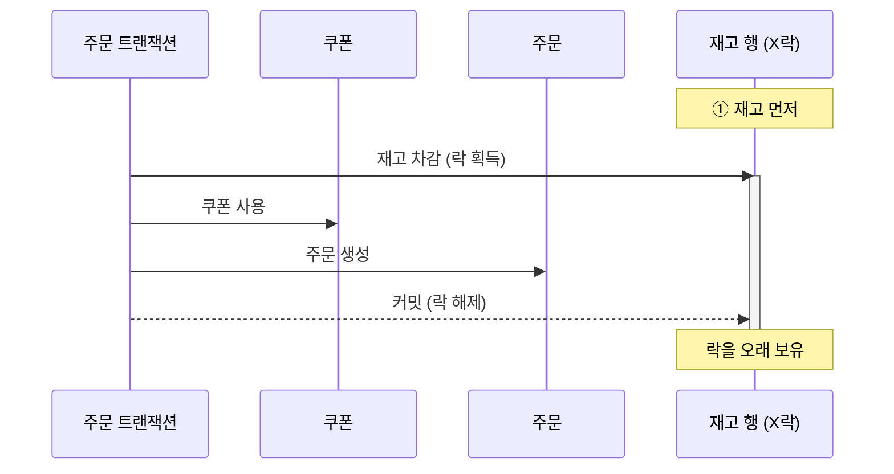
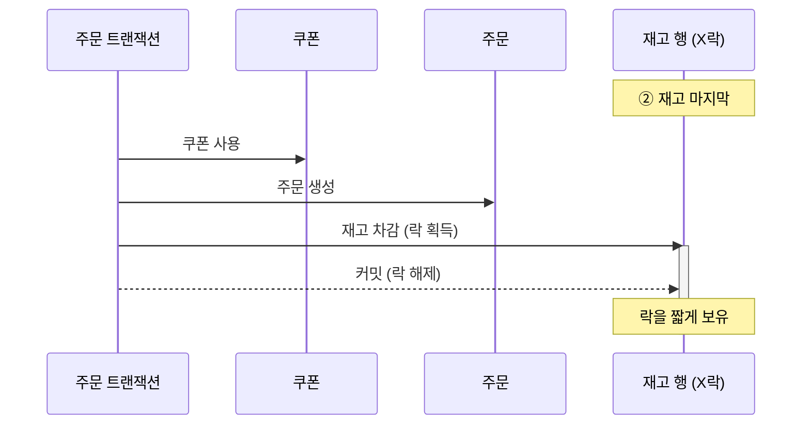

이번 주는 트랜잭션과 동시성 제어를 학습했다. Lost Update, 격리 수준, 비관적 락과 낙관적 락.
그리고 그걸 주문 흐름에 적용하면서, 재고를 어떻게 안전하게 깎을지 두 가지를 오래 고민했다.

## 비관락이냐 원자 UPDATE냐

재고 차감의 동시성 제어로 비관적 락과 원자적 조건부 UPDATE를 두고 골랐다.

비관락은 불변식을 도메인에 두는 대신 느리고, 원자 UPDATE는 빠른 대신 재고 규칙이 SQL로 새기 때문에 풍부한 도메인을 선택할지 빠른 SQL을 선택할지 고민했다.

그래서 비관락 쪽이 마음에 들면서도, 느리다는 게 걸렸지만 얼마나 느린지는 정확하게 몰랐다. 그냥 "원자 UPDATE가 더 빠르겠지"라고 감으로만 알고 있었다.
짐작으로 결정하긴 싫어서 측정해봤다.

같은 조건에서 동시성을 올려가며 두 방식을 측정했더니, 원자 UPDATE가 예상대로 빨랐다. worst-case에서 1.4 ~ 1.7배. 근데 절대값으로 보면 요청당 약 1ms였다.

> 원자적 UPDATE가 빠르다는 건 알았지만, 그 차이가 감수 못 할 정도인지는 재기 전엔 몰랐다.

그래서 성능이 결정에서 빠졌다. 빠른 게 사실이어도, 그 빠름이 도메인 표현을 포기할 만큼 결정적이지 않았다고 생각했기 떄문이다.

## 더 단순하다는 것도 틀렸다

성능이 빠지고 나니 기준은 하나 남았다고 생각했다. 원자 UPDATE는 빠른 대신 단순하고, 비관락은 느린 대신 도메인이 풍부하다. 그럼 풍부함을 택할 거냐 단순함을 택할 거냐.

근데 측정하려고 원자 UPDATE를 직접 코드를 작성해보니, 이 전제도 틀렸다.

`UPDATE ... WHERE quantity >= :amount` 한 문장이면 검증과 차감이 한 번에 된다고 생각했지만 두 개가 SQL로 표현하지 못했다.

하나, `amount <= 0` 가드. WHERE 조건은 amount가 0 이하면 항상 참이라, 음수 차감이 그냥 성공해버린다. 입력 검증은 SQL이 못 막아서 애플리케이션 코드에 그대로 남겨야 했다.
둘, 영향 0행이 "재고 부족"인지 "행 없음"인지 구분이 안 된다. 비관락은 둘을 구분하는데, 원자 UPDATE는 추가 조회 없인 못 한다. 에러 의미를 잃는 거였다.

그러니까 "빠른 대신 단순"이 아니었다. "빠른 대신 다른 걸 내주는" 거였다. 원자 UPDATE는 입력 검증과 에러 의미를 애플리케이션으로 밀어낸다. 어느 쪽도 대가 없이 깔끔하진 않았다.

남은 건 결국 "1ms를 내줄 거냐, 규칙이 두 군데로 쪼개지는 걸 받아들일 거냐"였다. 규칙이 SQL과 앱 가드로 나뉘면 재고 규칙이 바뀔 때 두 곳을 맞춰 고쳐야 한다. 나는 그 비용이 1ms보다 크다고 봤다. 그래서 비관락으로 갔다.

(측정 수치는 [design doc](https://github.com/loopers-labs/loop-pack-be-l2-vol4-java/issues/202)에 따로 정리해뒀다.)

## 순서는 정합성이 아니라 시간 문제였다

비관락으로 정하고 나니 다음 고민이 따라왔다. 주문에서 쿠폰 사용이랑 재고 차감, 어느 걸 먼저 해야 하나.

처음엔 순서가 의미 없다고 봤다. 쿠폰을 먼저 쓰든 재고를 먼저 깎든, 중간에 실패하면 어차피 트랜잭션이 통째로 롤백된다. 즉 정합성으로 보면 차이가 없으니까 최종 상태는 같다.

근데 다시 보니, 정합성은 같아도 다른 게 달랐다. 락을 보유하고 있는 시간이다.

재고에 비관적 락이 걸리면, 그 락은 잡은 순간부터 커밋까지 그 행을 붙들고 있다. 인기 상품 재고는 경합이 제일 심한 자원이다. 같은 상품을 노리는 주문들이 그 한 행에 줄을 선다.
그러니 재고를 먼저 깎으면, 그 비싼 락을 가진 상태로 쿠폰 처리랑 주문 생성까지 다 하는 동안 뒤에 줄 선 트랜잭션들이 계속 기다린다. 락을 갖고 있는 시간이 곧 처리량이다.

> 정합성은 순서를 안 가렸지만, 처리량은 순서를 가렸다.

그래서 경합 심한 재고를 마지막에 두기로 했다. 쿠폰 → 주문 → 재고. 비싼 락을 제일 늦게, 제일 짧게 잡는 거다.

같은 작업인데, 락을 보유하고 있는 시간이 달라진다.

### 쿠폰과 주문 생성이 끝날 때까지 재고 락을 보유

### 쿠폰, 주문을 먼저 처리하고 재고 차감 시에만 락을 보유

같은 일을 하는데 ①은 쿠폰과 주문 생성이 끝날 때까지 재고 락을 보유하고 있고, ②는 마지막에 잡아 커밋까지만 보유한다. 뒤에 줄 선 트랜잭션이 기다리는 시간이 딱 이 막대 길이만큼 차이 난다.

데드락은 또 다른 축이었다. 여러 자원에 락을 걸 때 모든 트랜잭션이 같은 순서로 잡으면 데드락이 안 생긴다. 모든 주문이 같은 `OrderFacade`를 타니 순서는 자동으로 통일된다. 다항목 주문이면 `product_id`로 정렬해서 잡으면 된다. 어느 순서를 고르든 "한 번 정하면 모두 그 순서를 따른다"가 핵심이었다.

## 그리고

이번 주 두 고민을 지나고 보니 닮아 있었다.

비관락이냐 원자 UPDATE냐는 처음엔 "성능 vs 도메인"의 문제인 줄 알았는데, 재보니 성능은 결정에서 빠지고 "어느 대가를 받아들일까"가 남았다.
차감 순서는 처음엔 "정합성" 문제인 줄 알았는데, 따져보니 정합성은 순서를 안 가리고 "락 보유 시간"이 남았다.

둘 다 처음 잡은 기준이 진짜 기준이 아니었다. 한쪽은 성능을, 한쪽은 정합성을 기준으로 보고 있었는데, 정작 결정을 가른 건 그 옆에 있던 다른 기준이었다.

이번주는 선택의 근거가 짐작이면 안된다는 것을 배웠다.
"원자 UPDATE가 빠르겠지", "순서는 의미 없겠지". 둘 다 안 재보고 머리로 내린 짐작이었고, 둘 다 재보니 결론이 달라졌다. 빠른 건 맞았지만 감수할 만했고, 순서는 정합성엔 의미 없었지만 처리량엔 의미 있었다.

기준을 잘 고르는 것만큼, 그 기준을 짐작이 아니라 재서 확인하는 게 중요하다는 걸 이번 주에 알았다.
